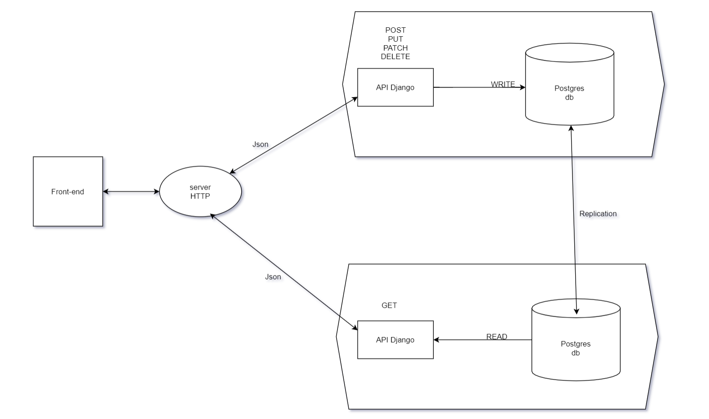

# CameraReviews system
---
## Overview: Problema a resolver
La empresa "RandomCameraReviews" necesita un sistema que permita que fotografos profesionales suban "reviews" de Camaras fotograficas, para que cualquier persona desde cualquier parte del mundo pueda buscar los los reviews y comprarlas a travez de su portal. La empresa cuenta con un equipo de developers especializado en frontEnd que realizara un portal para que los editores suban los "reviews" y los usuarios puedan verlos, y han solicitado que tu como especista en Backend, les proporciones un sistema, incluyendo API que permita realizar lo siguiente:

* Subir reviews de Camaras fotograficas
* Obtener el contenido de los reviews para mostrarlo en vistas del portal en sus versiones web y mobile.
* Manejo de usuarios para editores (no incluye visitantes que leen los reviews)

Tambien se sabe que la empresa "RandomCameraReviews" planea distribuir mayormente en America del Sur donde esta su mercado mas grande, pero tambien tienen ventas en norte america, Europa, y muy pocas en Asia.

#### Scope (casos de uso soportados)
Descripción...
* Como editor me gustaria poder subir una review de una camara
* Como editor me gustaria subir una review de un lente para las camaras
* Como editor me gustaria poder editar una review ya hecha
* Como editor me gustaria poder subir una review sobre accesorios para las camaras
* Como usuario no registrado me gustaria poder leer una review

#### Out of Scope (casos de uso No Soportados)
Descripción...
* Como usuario no registrado me gustaria poder subir una review de una camara
* Como usuario no registrado me gustaria poder comentar reviews
* Como usuario no registrado me gustaria poder compartir las reviews en mis redes sociales
* Como editor me gustaria poder dar feedback a otras reviews
* Como editor me gustaria poder editar la review de otro editor
* ...
---
## Arquitectura

### Diagramas

---
### Plan de pruebas
* Crear proyecto pruebas que valida los siguientes casos de uso.

- registrar usuario
- crear un producto
- editar el producto
- hacer una review del producto
- simular que un usario puede leer esa review

### Integracion continua
* Todo un test que valla desde registrar un usuario hasta simular que un usuario lea la review

---
## Limitaciones
Lista de limitaciones conocidas. Puede ser en formato de lista.
Ej.
* Llamada al API que permite subir una reeview, no excede los limites de latencia 500ms
* Llamadas al API que permite obtener reviews para lecture deben tener una latencia menor a 100ms
* Llamadas del API tienen latencia X
* No se soporta mas de X llamadas por segundo
---
## Costo
Descripción/Análisis de costos
Contenplando 1000 usuarios diarios, que visitan recurrentemente cada hora:
Ejemplo:
"Considerando N usuarios diarios, M llamadas a X servicio/baseDatos/etc"
* 1000 llamadas diarias a serverless functions. $XX.XX
* 1000 read/write units diarias a X Database on-demand. $XX.XX
Total: $xx.xx (al mes/dia/año)l